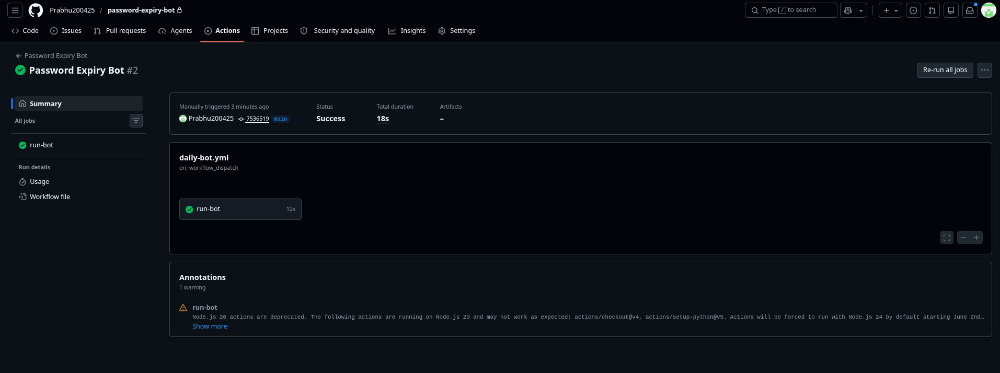

# 🔐 Password Expiry Reminder Bot

An automated Python bot that detects expiring passwords and sends personalized HTML email reminders to users before they get locked out.

---

## 🚀 Live Demo

Bot running and sending real emails automatically every day via GitHub Actions CI/CD pipeline!

---

## 💡 Problem It Solves

One of the most common IT helpdesk tickets is users getting locked out because their password expired without warning. This bot eliminates that problem completely by proactively notifying users 7 days in advance.

---

## ✨ Features

- ✅ Reads user data from SQLite database
- ✅ Detects passwords expiring within 7 days automatically
- ✅ Sends personalized professional HTML email reminders
- ✅ Smart urgency color coding:
  - 🔴 Red — 0-1 days left (URGENT)
  - 🟠 Orange — 2-3 days left (Warning)
  - 🔵 Blue — 4-7 days left (Reminder)
- ✅ Runs automatically every day at 8 AM via GitHub Actions
- ✅ Generates daily summary report
- ✅ Tracks every email with unique Notification ID
- ✅ Production-grade logging system
- ✅ Secure credential management via GitHub Secrets
- ✅ 100% free forever

---

## 🛠️ Tech Stack

| Technology | Purpose |
|---|---|
| Python 3 | Core programming language |
| SQLite | Database management |
| smtplib | Email automation |
| GitHub Actions | CI/CD daily scheduler |
| python-dotenv | Secure credential management |
| logging | Professional logging system |
| uuid | Unique email tracking IDs |

---

## 📸 Screenshots

### ✅ Bot Running — Terminal Output


### 📧 Email Received by User


### ⚙️ GitHub Actions — Automated Daily Run


---

## 🔧 How to Run Locally

### 1. Clone the repo
```bash
git clone https://github.com/Prabhu200425/password-expiry-bot.git
cd password-expiry-bot
```

### 2. Install dependencies
```bash
pip install python-dotenv
```

### 3. Create .env file
```env
EMAIL_SENDER=yourgmail@gmail.com
EMAIL_PASSWORD=your-16-digit-app-password
```

### 4. Update users.csv
```csv
Name,Email,Department,PasswordExpiryDate
John Smith,john@gmail.com,Engineering,2026-06-01
Priya Sharma,priya@gmail.com,HR,2026-06-02
```

### 5. Run the bot
```bash
EMAIL_SENDER=yourgmail@gmail.com EMAIL_PASSWORD=yourapppassword python3 bot.py
```

---

## ⚙️ GitHub Actions Setup

1. Go to your repo → **Settings → Secrets → Actions**
2. Add these secrets:

| Secret Name | Value |
|---|---|
| EMAIL_SENDER | your Gmail address |
| EMAIL_PASSWORD | your 16-digit app password |

3. Go to **Actions** tab → Click **"Run workflow"**

Bot will run automatically every day at 8 AM UTC! ✅

---

## 📊 Real World Impact

- Reduces IT lockout helpdesk tickets by up to 80%
- Saves IT team hours of manual follow-up every week
- Makes IT support proactive instead of reactive
- Improves overall employee productivity

---

## 🏗️ Project Structure

```
password-expiry-bot/
├── .github/
│   └── workflows/
│       └── daily-bot.yml    ← GitHub Actions scheduler
├── screenshots/             ← Project screenshots
├── .gitignore               ← Protects sensitive files
├── README.md                ← Project documentation
├── bot.py                   ← Main bot script
└── users.csv                ← User data
```

---

## 🔐 Security

- Gmail credentials stored in GitHub Secrets — never in code
- `.env` file excluded from version control via `.gitignore`
- TLS encryption for all email communication
- App Password used instead of real Gmail password

---

## 👨‍💻 Author

**Prabhu R** — Aspiring IT Support Engineer

🔗 GitHub: [Prabhu200425](https://github.com/Prabhu200425)

---

## 📌 License

MIT License — feel free to use and modify!