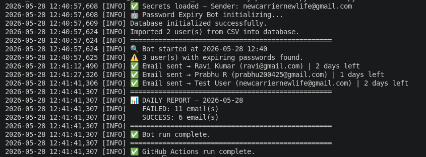
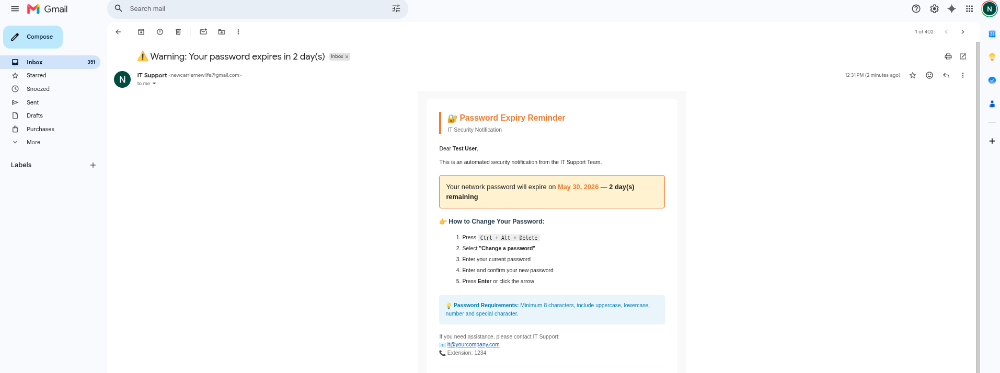

# 🔐 Password Expiry Reminder Bot

An automated Python bot that detects expiring passwords and sends
personalized HTML email reminders to users before they get locked out.

## 🚀 Live Demo
Bot running and sending real emails automatically every day!

## 💡 Problem It Solves
One of the most common IT helpdesk tickets is users getting locked out
because their password expired. This bot eliminates that problem by
automatically warning users 7 days in advance.

## ✨ Features
- Automatically checks for passwords expiring within 7 days
- Sends personalized HTML email reminders
- Runs on a daily schedule without manual effort
- Reduces IT helpdesk lockout tickets
- Deployed on cloud (PythonAnywhere)

## 🛠️ Tech Stack
- Python 3
- smtplib — Email automation
- python-dotenv — Secure credential management
- schedule — Task automation
- CSV — User data management

## 📸 Screenshots
## 📸 Screenshots

### ✅ Bot Running — Terminal Output

### 📧 Email Received by User

## 🔧 How to Run
1. Clone the repo
   git clone https://github.com/Prabhu200425/password-expiry-bot.git

2. Install dependencies
   pip install schedule python-dotenv

3. Add your credentials in .env file
   EMAIL_SENDER=yourgmail@gmail.com
   EMAIL_PASSWORD=your-app-password

4. Run the bot
   python3 bot.py

## 📌 Real World Impact
In a real IT environment this bot can:
- Reduce lockout helpdesk tickets by up to 80%
- Save IT team hours of manual follow-up
- Improve employee productivity

## 👨‍💻 Author
Prabhu R — Aspiring IT Support Engineer
